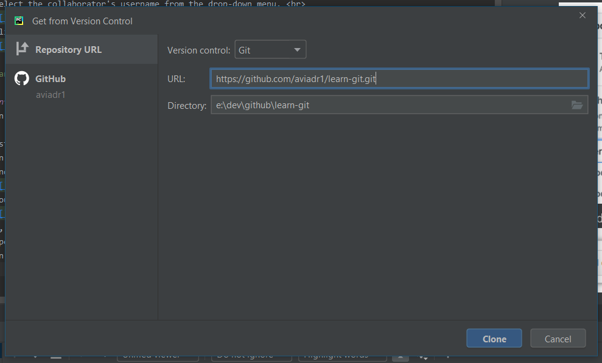

# Tutorial 01 - setting up on github

## Forking
Most tutorials have you start with an empty repository.
in this tutorial we will start with a pre-populated reqpository in order to better simulate real-life scenarios

1. go to the [learn-git repository on GitHub](https://github.com/aviadr1/learn-git/)
2. fork the repository \[[help](https://help.github.com/en/github/getting-started-with-github/fork-a-repo)\]
   

### if you're a group of developers learning together
 
Please fork the repository once for the whole group
- ask your entire group to signup to github
- add your team members as collaborators for the fork  
   - Under your repository name, click  Settings  
      
   - In the left sidebar, click Collaborators.  
     
   - Under "Collaborators", start typing the collaborator's username.  
   - Select the collaborator's username from the drop-down menu.  
     
   - Click Add collaborator. 
     

> You and your collaborators should all now have access to a private github remote repository shared between yourselves!

## cloning with pycharm
You can use git command-line or other tools to clone from github. but in this tutorial we will do it using pycharm.

1. First, lets get the URL of the repository on github
   - On GitHub, navigate to the main page of the repository.
   - Under the repository name, click Clone or download.  
     
   - you should now see a dialog like this. copy the URL from the dialog  
     
2. Now, we clone this URL using pycharm
   - Open PyCharm
   - in the PyCharm menu, choose `VCS | Checkout from Version Control | Git`. or in some versions it might be `VCS | Get from source control`
     
   - paste the URL you got from step #1
   - press `Clone` button
   
> You should now have the repository on your computer, with a PyCharm project built from it 

## setting up username/password
if you've never used git on the computer before, or never setup a global git user/password
you will need to set this up now.

in order to make sure we're not mixing any work-related emails with this tutorial, 
lets configure the username/password _specifically_ for __this__ repository

    git config --local user.name "YourFirstName YourLastName"
    git config --local user.email your@emailaddress.com
   
Use the email address you used for signing up for github

