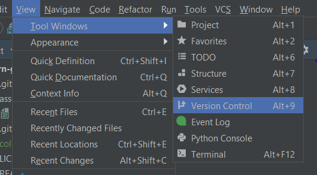
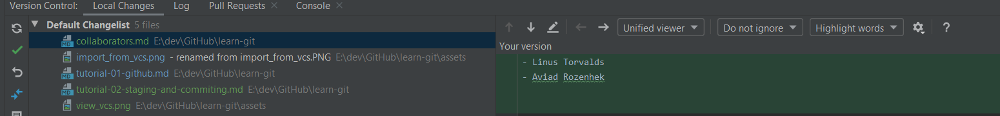
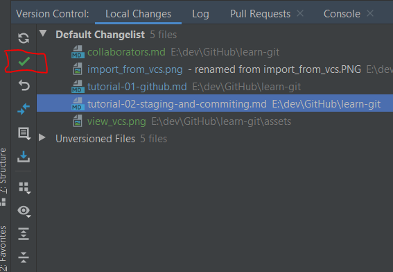
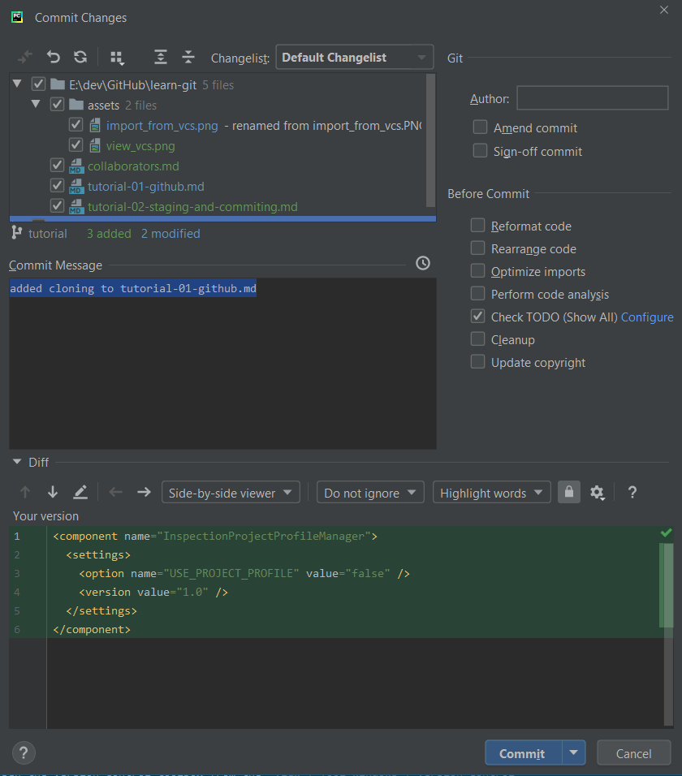
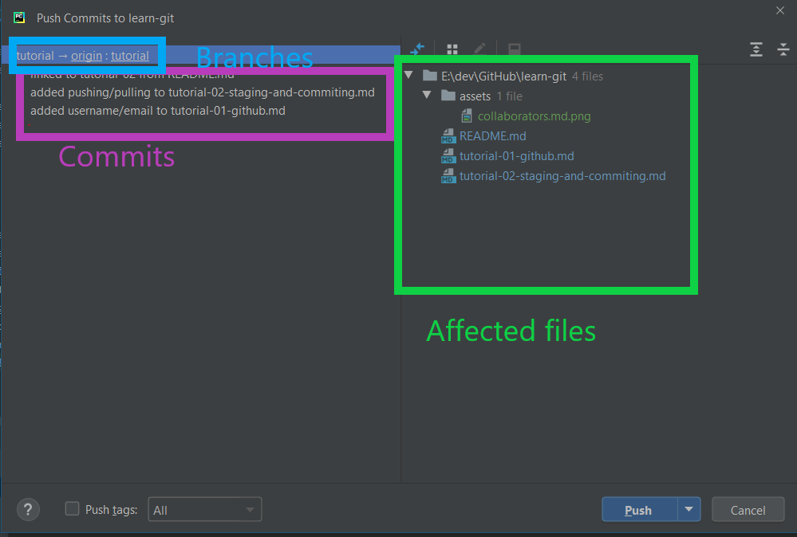
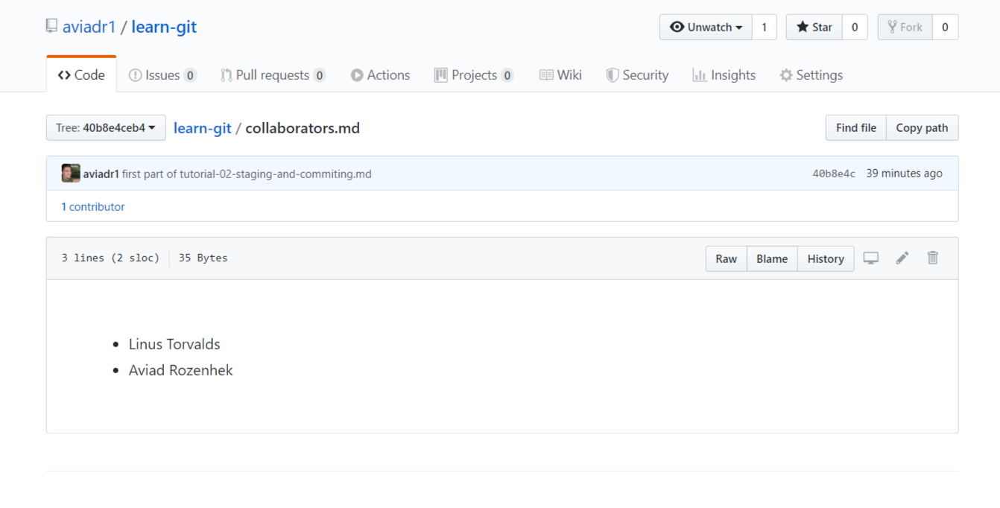

# Tutorial 02 - staging and committing

in this tutorial we will show how to stage and commit files using pycharm

## Simple scenario
1. Make changes
   open the file `collaborators.md` with pycharm. add your name to the list of collaborators
2. open the version control toolbox from the `View | Tool windows | Version control` 
   or use the keyboard shortcut `Alt+9`
   
3. You should see the changes you made to `collaborators.md` in the `default changelist` view
   
4. Click the `Commit changes` icon in the version Control Tool Box, or click `CTRL+K`
   
5. This opens the Commit dialog, in which you select the files to commmit from a list 
   of changed or unversioned files. select the `collaborators.md` file you edited 
   and add a commit message that explains your edit, and click the `Commit` button
   
   > You've already setup your user/email in [tutorial-01](tutorial-01-github.com) so no need to put anything in the  `Author` box 

   

> Here's a full [documentation](https://www.jetbrains.com/help/pycharm/commit-and-push-changes.html) on pycharm commit process 
## pushing and pulling

Lets sync our work to the main repository on github by pushing our work.
1.  Before pushing your changes, sync with the remote and make sure your local copy of the repository 
    is up-to-date to avoid conflicts.
    - From the main menu, choose `VCS | Git | Pull`. The Pull Changes dialog opens.
      click the `Pull` button
    - If you're working on this tutorial with fellow contributors, 
      you might see their changes getting pulled into your local repository now
2. Press Ctrl+Shift+K or choose `VCS | Git | Push` from the main menu. 
   The Push Commits dialog opens showing all Git repositories
   Click the `Push` button 
   
3. lets view our work on `github.com`
   - go to your repository on github.com
   - click the collaborators.md file
   - Your changes (and your collaborators' changes, if there are any) are now in the main repository
     
     

   

    
   
    
    
